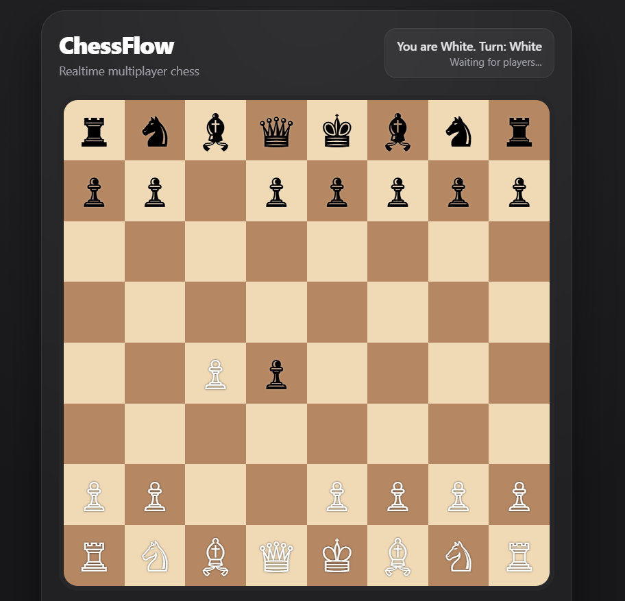
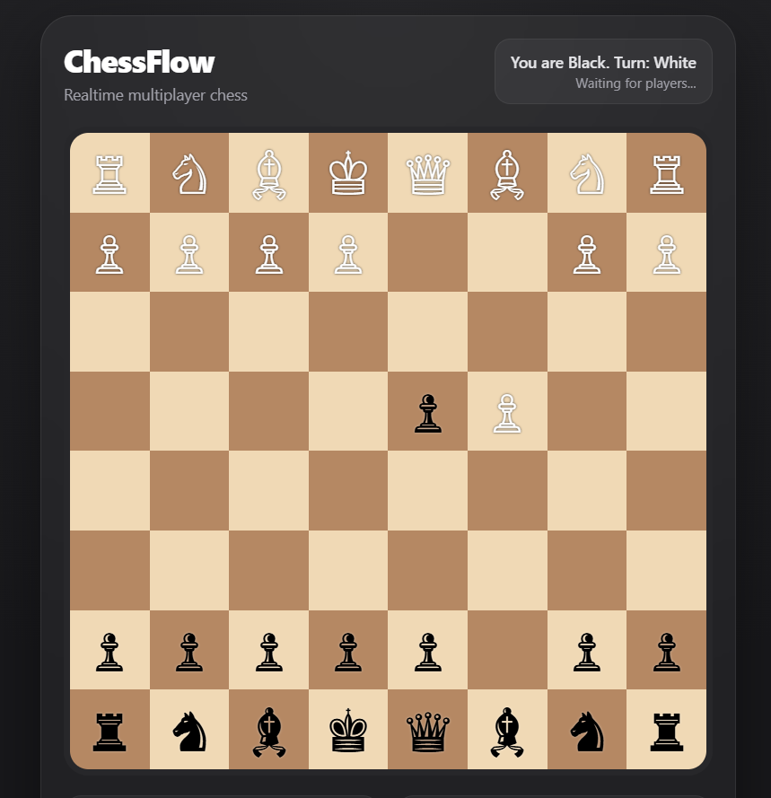

# ♟️ ChessFlow - Realtime Multiplayer Chess

A real-time multiplayer chess application built using **Node.js, Express, Socket.IO, Chess.js, and EJS**.

ChessFlow enables players to compete live in the browser through synchronized gameplay, realtime move updates, and interactive turn-based sessions.

## 🌐 Live Demo

https://chess-flow-gamma.vercel.app/

---

## ✨ Features

- Realtime multiplayer chess gameplay
- Live move synchronization
- Turn-based game handling
- Automatic board state updates
- Player color assignment
- Interactive chess interface
- Responsive gameplay layout

---

## 🚀 Tech Stack

- Node.js
- Express.js
- Socket.IO
- Chess.js
- EJS
- JavaScript

---

## 📸 Screenshots

---

## 🧠 What I Learned

- Realtime communication with Socket.IO
- Multiplayer synchronization workflows
- Shared state management
- Chess rule implementation using Chess.js
- Client-server event handling
- Interactive backend-driven application architecture
- Building websocket-powered applications with Express

This project improved my understanding of realtime systems and multiplayer interaction handling.

---

## 💡 Future Improvements

- Matchmaking system
- Game room support
- Spectator mode
- In-game chat
- Timer functionality
- Match history
- Authentication system
- Rankings and leaderboards

---

## 👩‍💻 Author

**Ayesha Ansari**

Built with ❤️ using Node.js and Socket.IO